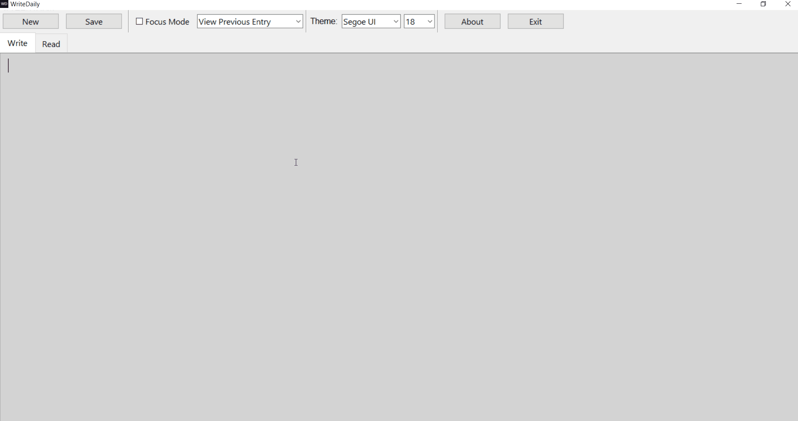

# WriteDaily 🖊️

**WriteDaily** is a clean, minimalist journaling desktop app built in Python with a focus on distraction-free writing. Built using Tkinter, it offers a beautiful interface with customizable fonts, auto-save, theming, and a full-screen focus mode for daily journaling.

---

## ✨ Features

- Write/Read tabs for easy journaling and browsing
- Save entries as `.txt` files, also logged in a `.json` file
- Combobox to browse previous entries by date
- Toolbar with font and theme selection
- **Focus Mode**: hides UI and enters fullscreen
- Small toggle button and ESC key exit focus mode
- Autosave with timestamped entries
- Distraction-free interface with hidden scrollbars
- Custom icons and About window with clickable social links
- Exports as `.exe` for Windows with bundled assets and icon

---

## 📓 How to Use

1. Write your journal entry in the **Write** tab.
2. Click **Save** to store your entry (or rely on auto-save).
3. Switch to the **Read** tab to view past entries.
4. Use the dropdown to pick a date and view logs.
5. Enable **Focus Mode** for distraction-free writing.
6. Exit Focus Mode with the ✕ button or **Escape** key.

---

## 🛠 Running the App

### ▶️ Option 1: Run the Python script

Make sure you have Python 3 installed.

```bash
python WriteDaily.py
```

### 💾 Option 2: Run the Windows `.exe`

Download the packaged `.exe` from the [Releases](../../releases) section.

No install required — just double-click and start journaling.

---

## 🖼️ Screenshots



---

## 💡 Compatibility

- ✅ Windows 10/11 (tested `.exe`)
- ✅ Python 3.8+ if running from source

---

## 📁 Files Created

- `/Entries/` — Contains daily `.txt` journal files
- `journal_entries.json` — Internal index for saved entries

---

## 📄 License

MIT License.  
Created with ❤️ by Trevor Browning.
